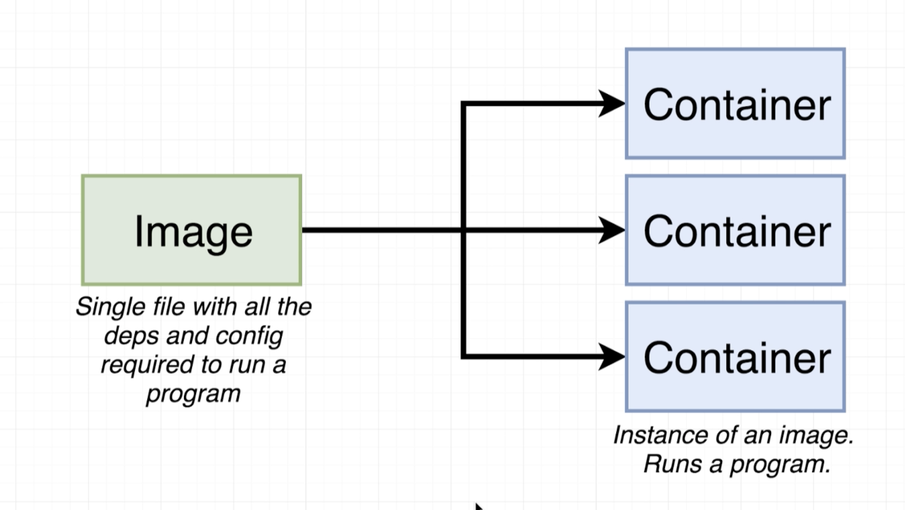
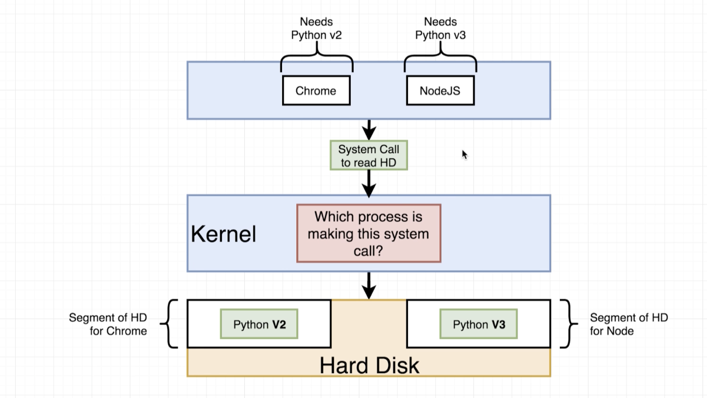
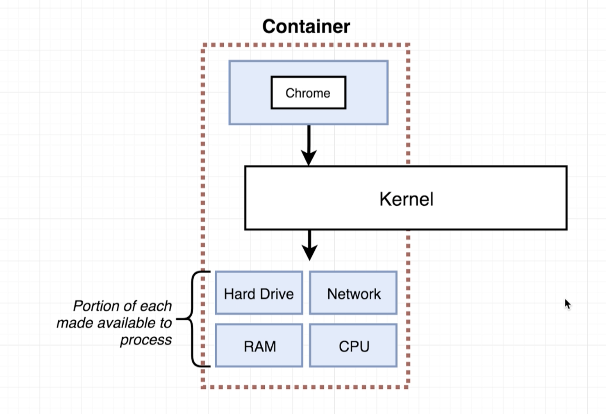
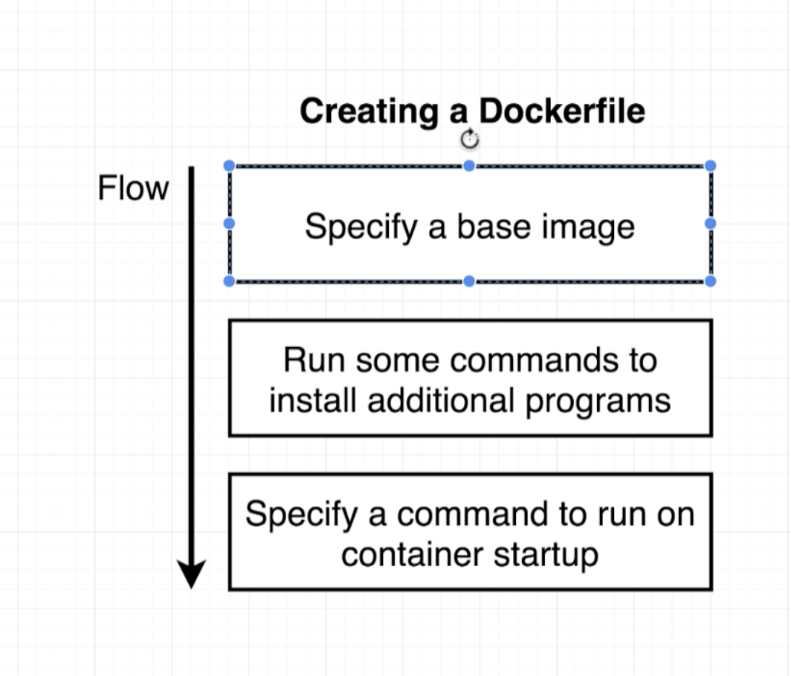

Notes on Udemy Course: [Docker and Kubernetes: The Complete Guide](https://www.udemy.com/course/docker-and-kubernetes-the-complete-guide)


- Why use Docker?
Because it makes it easy to install and run software without worrying about setup and dependencies.

- What is Docker?
Docker is a platform or ecosystem for creating and running containers.

The **Docker CLI** reaches out to **Docker Hub** and downloads an **Image** which contains all configs and dependencies required to run a program. The **Container** is an instance of an image or a running program of sorts with its own set of resources like memory, networking tech and hard drive space.

Docker for Mac contains two tools:
- **Docker Client (CLI)**: where we issue commands to
- **Docker Server (Daemon**): responsible for creating images, running containers, etc




Example: `docker run hello-world`
Output:
```
Unable to find image 'hello-world:latest' locally
latest: Pulling from library/hello-world
1b930d010525: Pull complete
Digest: sha256:fc6a51919cfeb2e6763f62b6d9e8815acbf7cd2e476ea353743570610737b752
Status: Downloaded newer image for hello-world:latest

Hello from Docker!
This message shows that your installation appears to be working correctly.

To generate this message, Docker took the following steps:
 1. The Docker client contacted the Docker daemon.
 2. The Docker daemon pulled the "hello-world" image from the Docker Hub.
    (amd64)
 3. The Docker daemon created a new container from that image which runs the
    executable that produces the output you are currently reading.
 4. The Docker daemon streamed that output to the Docker client, which sent it
    to your terminal.
```

The Docker Server tries to find the requested image in the **image cache**. If it does not find it, it reaches out
to Docker Hub to download the file and store it in the cache.

- What is a Container?

Your OS Kernel is the intermediate between running processes and the hard disk. The requests are issued
from the program as **system calls** to the kernel to, for instance, write a file to disk.

We can segment out the HD to house different resources and their versions and hence run specific programs. This is called **namespacing**: isolating resources per process or group of processes. Then when the request is issued, the kernel figures out which segment of the HD to direct that to. **Control groups** are used to limit the amount of resources per process (memory, CPU, HD I/O, network bandwidth). A container encompasses all those aspects.

Note: Namespacing and control groups are specific to the Linux system, not Windows or MacOS. We then use a Linux virtual machine where containers will be created. The Linux kernel now is the one responsible for isolating hardware resources or limit access to them in your computer.





- `docker run <image name>` - `docker run hello-world`
- `docker run <image name> command` - `docker run busybox ls` (overrides the image startup command), ls will list out files in the directory
- `docker ps` to list all containers currently running in your machine
- `docker ps --all` will list all containers ever created in your machine
- `docker run =  docker create + docker start`
- `docker create hello-world` and `docker start -a container_id` (the start will execute the primary startup command, use flag -a to attach to the container and print out its output, docker run does the log of the output automatically)
- `docker start -a container_id` can also be used to restart exited containers, but you cannot replace the command used the first time
- `docker system prune` to delete stopped containers and build cache (images fetched from docker hub)

```WARNING! This will remove:
  - all stopped containers
  - all networks not used by at least one container
  - all dangling images
  - all dangling build cache
```

- `docker logs container_id` to log information emitted from stopped containers, does not run the container!
- `docker stop container_id` allows some time for shutdown and cleanup but 10s later it issues a kill command (preferable)
- `docker kill container_id` shuts down the container immediately
- Example: `docker run redis` to startup a local redis server, then to run the redis-cli and have access to that container running the server (or put in other words run two programs inside the same container), we need to run `docker exec -it container_id redis-cli` (exec to execute a second command inside the same container, `-it` flag to send input text to the running container, -i to attach to STDIN of running program and -t to format output)
- `docker exec -it container_id sh` to drop into a shell inside the container
- `docker run -it busybox sh` to run and be dropped into a container shell

- **Dockerfile**: plain text file with configuration to define how our container should behave (programs it contains, what is does at startup). The Docker Client will hand it over to the Docker Server which will convert it to a usable image.



Example: Create an image to run redis-server.
```
# Use an existing docker image as a base
FROM alpine

# Download and install a dependency
RUN apk add --update redis

# Tell the image what to do when it starts
# as a container
CMD ["redis-server"]
```

- Most important instructions: `FROM` to specify **base image**, `RUN` to execute commands when preparing the image and `CMD` to execute when image is used to startup a new container.

To build the image from the Dockerfile we run `docker build .`. That returns an image id which we use to then run the container with `docker run image_id`. Or we could also run `docker build -t lugomes/redis:latest .` to tag the image and avoid having to paste in the image id in the run command. Then you can run as `docker run lugomes/redis` (latest is used by default).

Specifying the base image is analogous to installing an OS in a computer to sort of create an initial infrastructure to further customize our system.

In detail, the step 2 uses the previously created image (base image) to create a temporary container and execute the run command. The container is then stopped and a temporary image is created with the FS snapshot with redis installed. Then step 3 takes the previous image and creates a new temporary container and sets the the primary command, then creates another image, the final output.


If we run a second time, Docker uses the build cache which adds performance. If a new command is added, a temporary container is created for that step and new image outputted since this was not cached previously. If the order of operations changes, the cache is not used. So the lesson is: make changes as far down as possible to use cache for as much lines as possible :)
```
Sending build context to Docker daemon  2.048kB
Step 1/4 : FROM alpine
 ---> e7d92cdc71fe
Step 2/4 : RUN apk add --update gcc
 ---> Using cache
 ---> de277e133667
Step 3/4 : RUN apk add --update redis
 ---> Using cache
 ---> 168eeaace8c7
Step 4/4 : CMD ["redis-server"]
 ---> Using cache
 ---> fb6ef696a164
Successfully built fb6ef696a164
```

Side-note (not recommended): Manual image creation with docker commit
`docker run -it alpine sh`
`apk add --update redis`

In a second terminal:
`docker ps` to get id of running container
`docker commit -c 'CMD ["redis-server"]' container_id`
Then you can run the aforementioned generated image id.

Example:
Create a simple web application that simply shows number of visits.
Use node.js as web server and redis as in-memory datastore (in the example it stores number of visits).
Note: we could run both node app and redis inside the same container but if more containers are created (app scales), the redis instances will diverge in number of visits.
So to scale up the node server alone, we have to run the redis server in a separate conteiner. But these containers now need to talk to each other...

```
# Specify a base image
FROM node:alpine

WORKDIR /app

# Install some dependencies
COPY ./package.json ./
RUN npm install
COPY . .

# Default command
CMD ["npm", "start"]
```
Notes:
- Alpine image has very few programs pre-installed, not npm for instance. Alpine is a term in the Docker world for an image that is small as possible. The base image used here is `node:alpine` (repo:tag-name) to have npm installed.
- `COPY ./package.json ./` to copy over the file from your local filesystem into the temporary container filesystem.


- Container port mapping: we tried to hit port 8080 but the traffic would not be directed to the available container ports. We need to specify an explicit port mapping! To do that, we pose a runtime constraint as `docker run -p 8080:8080 image-id` meaning forward incoming traffic to local machine port 8080 to container port 8080. The ports do not have to be identical!

- `WORKDIR /usr/app` and `COPY ./ ./` to avoid copying local files into the root directory (and potentially overriding default files created from the base image). It will then copy to the `/usr/app` directory. Any following command will be executed relative to this path in the container.

- `COPY ./ ./` below `RUN npm install` and `COPY ./package.json ./` so that dependencies are not installed again with app changes. Only rebuild if package.json changes.

- Be aware that currently changes in the app are not automatically copied over to the container FS. We would need to rebuild the image. There is extra configuration needed to manage hot reloading.

### Docker-compose

- We run the node app in one container and the redis server in another container (just running `docker run server` will do the trick). If we just run both in separate shells, they are not automatically going to talk to one another. We need to create some networking infrastructure between them! 
- There are two options: Docker CLI network features (complicated to use) or **Docker Compose**. We create a separate file `docker-compose.yml` to house commands we would normally write in the shell to the Docker CLI. Now the docker-compose CLI will parse our file and create the separate containers with the configurations we specified. Now docker-compose sort of takes over Docker CLI but allows us to issue commands much quicker and create infrastructure to run multiple containers in the background.


 
```
version: '3' # version of docker-compose
services: # service is a type of container
  redis-server:
    image: 'redis'
  node-app:
    build: . # look in the current dir and use the Dockerfile to create this image
    ports:
      - "4001:8081" # local machine to container port mapping
```

Note: **Creating the two services in the same docker-compose.yml file automatically creates the containers in the same network**, therefore allowing communication between them. To start up we run `docker-compose up`. We don't need to specify the image because it will auto look for the docker-compose.yml file. To rebuild images inside docker-compose file we run `docker-compose up --build`.

- `docker-compose up -d` to launch containers in the background and `docker-compose down` to stop them. `docker-compose ps` to print out the status of the containers built from the docker-compose.yml file. You need to be inside the directory where the yml file is located to be able to use `docker-compose ps` as opposed to `docker ps`.

- **Restart policies** in case our container crashes:
   - "no": never attempt to restart if container stops or crashes
   - always: always restart if container stops for any reason
   - on-failure: only restart if container stops with an error code
   - unless-stopped: always restart unless we forcibly stop it

For a web app for example we would use always restart policy since we always want it to be available. But for worker process we could use the on-failure policy since the exit would occur naturally after processing has finished.

## Development Workflow

Development > Testing > Deployment > Repeat

We usually push code to a development branch of sorts (e.g. `feature`) and create a pull request to merge that code into the `master` branch. The `master` branch should contain our clean working copy of our codebase whose changes will be automatically deployed to our hosting provider. When the PR is created, we setup a workflow to push our application to the `Travis CI` service (continuous integration provider that runs our app tests). Then, is tests ran successfully, we can merge our branch into master. Then we push again to `Travis CI` and finally have Travis CI push to `AWS Hosting` to deploy our app.

Where does Docker comes in?
It is not needed at all, it makes it easier to execute the tasks in the workflow though. 

We created a `Dockerfile.dev` with this custom name. To run that file we run `docker build -f Dockerfile.dev .`. After building we run `docker run -it -p 3000:3000 <container_id>`. To hot reload (incorporate source code changes without need to manually rebuild the image and re-run), we make use of `volumes`. We will no longer copy the FS over to the docker container but we will place references to the local machine instead, sort of like folder mapping. We run `docker run -it -p 3000:3000 -v /app/node_modules -v $(pwd):/app <image_id>`. To run tests, run `docker run -it <image-id> npm run test`.

For the prod environment we need a server to respond to incoming request. We make use of `nginx`, popular web server with little logic that is used to serve simple static content. So we create a separate `Dockerfile` that creates a production version of our web app using nginx to serve our static files created with the build. 

Caveat is that dependencies are only required to build the app, after we have the static files, we no longer need to dedicate all the space for that. We will need to make use of two base images, one for node and other for nginx, i.e. we say that the Dockerfile will have a `multi-step build process`, with two blocks of configs. The `build phase` uses node:alpine inage to build the app and the `run phase` will use nginx as the base image to copy over the build folder and serve it. The second phase does not copy the dependencies over, so we save space!

```
# Build Phase
FROM node:alpine as builder

WORKDIR /app

COPY ./package.json .
RUN npm install
COPY . .

RUN npm run build

# Run Phase
FROM nginx

COPY --from=builder /app/build /usr/share/nginx/html
```