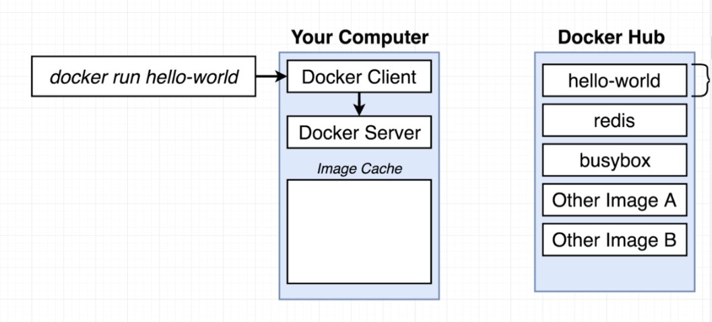
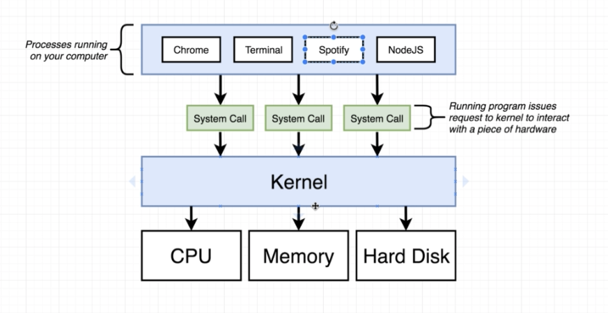
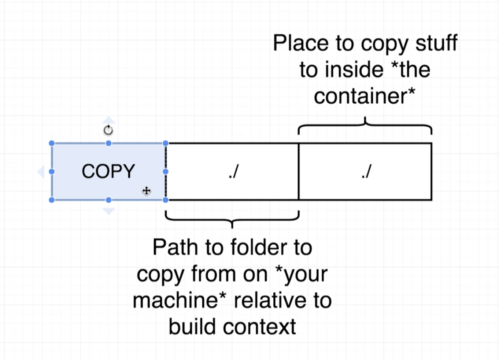
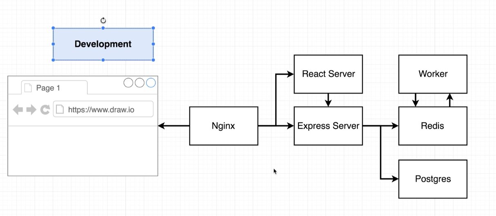
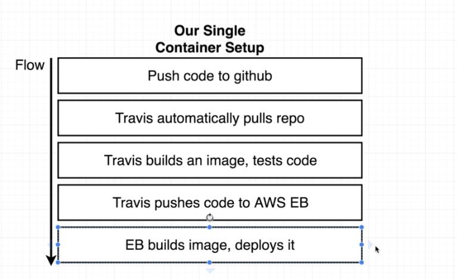
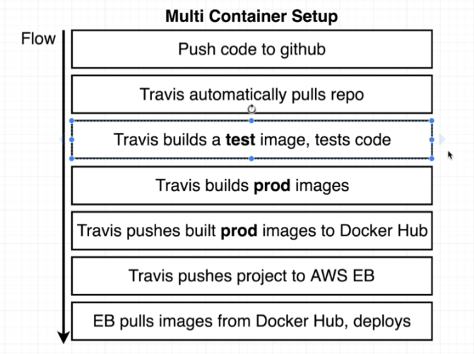
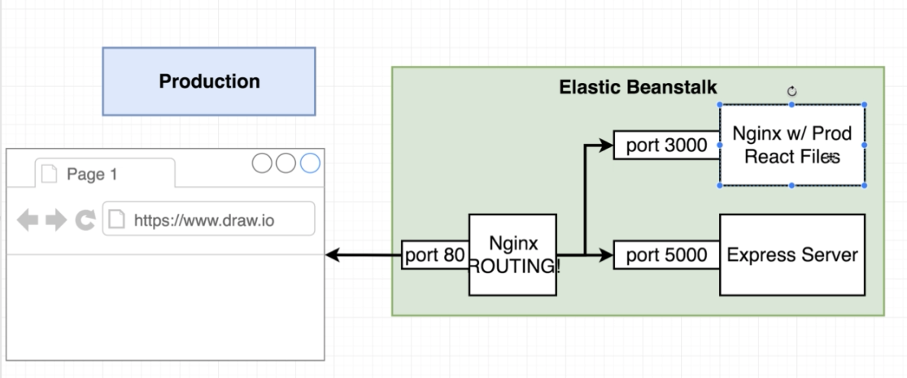

Notes on Udemy Course: [Docker and Kubernetes: The Complete Guide](https://www.udemy.com/course/docker-and-kubernetes-the-complete-guide)

# Docker

### Dive Into Docker!

- Why use Docker?
Because it makes it easy to install and run software without worrying about setup and dependencies.

Example: Running `redis` with Docker: `docker run -it redis`.

- What is Docker?
Docker is a platform or ecosystem around creating and running containers.

The **Docker CLI** reaches out to **Docker Hub** and downloads an **Image** which contains all configs and dependencies required to run a program. The **Container** is an instance of an image or a running program of sorts with its own set of resources like memory, networking tech and hard drive space.

Docker for Mac contains two tools:
- **Docker Client (CLI)**: where we issue commands to
- **Docker Server (Docker Daemon**): responsible for creating images, running containers, etc


Example: `docker run hello-world`

Output:
```
Unable to find image 'hello-world:latest' locally
latest: Pulling from library/hello-world
1b930d010525: Pull complete
Digest: sha256:fc6a51919cfeb2e6763f62b6d9e8815acbf7cd2e476ea353743570610737b752
Status: Downloaded newer image for hello-world:latest

Hello from Docker!
This message shows that your installation appears to be working correctly.

To generate this message, Docker took the following steps:
 1. The Docker client contacted the Docker daemon.
 2. The Docker daemon pulled the "hello-world" image from the Docker Hub.
    (amd64)
 3. The Docker daemon created a new container from that image which runs the
    executable that produces the output you are currently reading.
 4. The Docker daemon streamed that output to the Docker client, which sent it
    to your terminal.
```


The Docker Server tries to find the requested image in the **image cache**. If it does not find it, it reaches out
to Docker Hub to download the file and store it in the cache. Then a container is created out of it.

- What is a Container?

Your OS Kernel is the intermediate between running processes and the hard disk. The requests are issued
from the program as **system calls** to the kernel to, for instance, write a file to disk.

We can segment out the HD to house different resources and their versions and hence run specific programs. This is called **namespacing**: isolating resources per process or group of processes. Then when the request is issued, the kernel figures out which segment of the HD to direct that to. **Control groups** are used to limit the amount of resources per process (memory, CPU, HD I/O, network bandwidth). A container encompasses all those aspects.

Note: Namespacing and control groups are specific to the **Linux** system, not Windows or MacOS. We then use a Linux virtual machine where containers will be created. The Linux kernel now is the one responsible for isolating hardware resources or limit access to them in your computer. Behind the scenes, Docker install comes with a Linux VM and all containes are hosted by the Linux Kernel!

A container emcompasses the running program and all resources dedicated to it. An image is simply put a filesystem snapshot and a startup command.




### Manipulating Containers with the Docker Client

- Create and run a container from an image: `docker run <image name>` (e.g. `docker run hello-world`).
- Create and run a container from an image and override the startup command: `docker run <image name> command` (e.g. `docker run busybox ls`).
- List all containers running in your machine: `docker ps`.
- List all containers ever created in your machine: `docker ps --all`.
- `docker run` =  `docker create` (FS) + `docker start` (startup command).
- `docker create hello-world` and `docker start -a <container id>` (the start will execute the primary startup command, use flag -a to attach to the container and print out its output, docker run attaches automatically).
- To restart a stopped container: `docker start -a <container id>`. Caveat: we cannot replace the command used the first time the container ran the other times around.
- To delete stopped containers and image cache: `docker system prune`.

```WARNING! This will remove:
  - all stopped containers
  - all networks not used by at least one container
  - all dangling images
  - all dangling build cache
```

- To get logs ever emitted from a stopped container: `docker logs <container id>`. Note: it does not start the container back up!
- To stop a container: `docker stop <container id>`. Note: this allows some time for shutdown and cleanup but 10s later it issues a kill command if it has not stopped yet.
- To kill a container: `docker kill container id`. Note: shuts down the container immediately.
- To execute an additional command inside a running container: `docker exec -it <container id> command`.
Example: `docker run redis` to startup a local redis server in one shell, then to run the `redis-cli` and have access to the container running the server, we need to run `docker exec -it <container id> redis-cli` (`exec` to execute another command inside the same container, `-it` flag to send input to the container).
Side note on IT flag: Every process we create in a Linux machine has three communication channels `STDIN`, `STDOUT` and `STDERR`. The `-it` flag combines: `-i` to attach terminal to `STDIN` channel of the process and `-t` to format the output.
- To be dropped into a shell inside a running container: `docker exec -it <container id> sh`. Note: `sh` is a **command processor** executed inside the container like zsh, bash...
- To create, run a container and get dropped into a shell: `docker run -it busybox sh`. The downside is that the default startup command is no longer executed. Frequently we will want to then start up the container, have it execute the startup command and then attach to it using `docker exec -it <container id> sh` command.

Containers are isolated by default, they cannot communicate to each other unless we config them to.

### Building Custom Images Through Docker Server

- **Dockerfile**: plain text file with configuration to define how our container should behave (programs it contains, what is does at startup). The Docker Client will hand it over to the Docker Server which will convert it to a usable image.


Example: Create an image to run redis-server.
```
# Use an existing docker image as a base
FROM alpine

# Download and install a dependency
RUN apk add --update redis

# Tell the image what to do when it starts
# as a container
CMD ["redis-server"]
```

- Most important instructions: `FROM` to specify **base image**, `RUN` to execute commands when preparing the image and `CMD` to execute when image is used to startup a new container.

To build the image from the Dockerfile we run `docker build .`. The `.` specifies the **build context** to locate the Dockerfile to be used to build the image from. That returns an image id which we then use to run the container with `docker run <image id>`. 

- To build an image and tag it with a custom id: `docker build -t lugomes/redis:latest .` That way we avoid having to paste in the image id in the run command. Then you can run as `docker run lugomes/redis` (latest is used by default).

Specifying the base image is analogous to installing an OS in a computer to sort of create an initial infrastructure to further customize our system.

In detail, the step 2 uses the previously created image (base image) to create a temporary container and execute the run command. The container is then stopped and a temporary image is created with the FS snapshot with redis installed. Then step 3 takes the previous image and creates a new temporary container and sets the the primary command, then creates another image, the final output.

**Takeaway**: For every instruction that we add to the Dockerfile, a temporary container is created based on the image from the previous step, the current command executed that changes its filesystem and finally another image is created from the updated snapshot of the temporary container's FS. The temporary container is shutdown and the image is ready for next instruction, if it exists.

```
Sending build context to Docker daemon  2.048kB
Step 1/3 : FROM alpine
latest: Pulling from library/alpine
cbdbe7a5bc2a: Pull complete
Digest: sha256:9a839e63dad54c3a6d1834e29692c8492d93f90c59c978c1ed79109ea4fb9a54
Status: Downloaded newer image for alpine:latest
 ---> f70734b6a266
Step 2/3 : RUN apk add --update redis
 ---> Running in 62c75c9d8475
fetch http://dl-cdn.alpinelinux.org/alpine/v3.11/main/x86_64/APKINDEX.tar.gz
fetch http://dl-cdn.alpinelinux.org/alpine/v3.11/community/x86_64/APKINDEX.tar.gz
(1/1) Installing redis (5.0.7-r0)
Executing redis-5.0.7-r0.pre-install
Executing redis-5.0.7-r0.post-install
Executing busybox-1.31.1-r9.trigger
OK: 7 MiB in 15 packages
Removing intermediate container 62c75c9d8475
 ---> 9f0126c9e79c
Step 3/3 : CMD ["redis-server"]
 ---> Running in 1710c8c1cf02
Removing intermediate container 1710c8c1cf02
 ---> d27851b95ddf
Successfully built d27851b95ddf
```


If we modify the Dockerfile to add in a second dependency and build the image again, Docker uses the build cache to get the image created up to the step that has changed and uses that to create the new final image - this adds a lot of performance. If a new command is added and a new build issued, only the steps from the change line on down are re-executed. The order of operations matter to retrieve the cache!!! So the lesson is: make changes as far down as possible to use cache for as many lines as possible.

```
Sending build context to Docker daemon  2.048kB
Step 1/4 : FROM alpine
 ---> f70734b6a266
Step 2/4 : RUN apk add --update redis
 ---> Using cache
 ---> 9f0126c9e79c
Step 3/4 : RUN apk add --update gcc
 ---> Running in 60ec233de463
(1/10) Installing libgcc (9.2.0-r4)
(2/10) Installing libstdc++ (9.2.0-r4)
(3/10) Installing binutils (2.33.1-r0)
(4/10) Installing gmp (6.1.2-r1)
(5/10) Installing isl (0.18-r0)
(6/10) Installing libgomp (9.2.0-r4)
(7/10) Installing libatomic (9.2.0-r4)
(8/10) Installing mpfr4 (4.0.2-r1)
(9/10) Installing mpc1 (1.1.0-r1)
(10/10) Installing gcc (9.2.0-r4)
Executing busybox-1.31.1-r9.trigger
OK: 102 MiB in 25 packages
Removing intermediate container 60ec233de463
 ---> 3a30bcfe05ed
Step 4/4 : CMD ["redis-server"]
 ---> Running in ec5a73867e4a
Removing intermediate container ec5a73867e4a
 ---> a59922404887
Successfully built a59922404887
```

Side-note (not recommended): Manual image creation with docker commit (as opposed to using Dockerfile to build it)
In one terminal:
`docker run -it alpine sh`
`apk add --update redis`

In a second terminal:
`docker ps` to get id of running container
`docker commit -c 'CMD ["redis-server"]' <container id>`
Then you can run a container out of the aforementioned generated image with `docker run <image id>`.

### Making Real Projects with Docker

Example: `simpleweb` web app
Create a simple web application that simply shows number of visits.
Use node.js as web server and redis as in-memory datastore (in the example it stores number of visits).
Note: we could run both node app and redis inside the same container but if more containers are created (app scales), the redis instances will diverge in number of visits.
So to scale up the node server alone, we have to run the redis server in a separate conteiner. But these containers now need to talk to each other...

```
# Specify a base image
FROM node:alpine

WORKDIR /usr/app

# Install some depenendencies
COPY ./package.json ./
RUN npm install
COPY ./ ./

# Default command
CMD ["npm", "start"]
```
Notes:
- Alpine image has very few programs pre-installed, not `npm` for instance. Alpine is a term in the Docker world for an image that is small as possible. The base image used here is `node:alpine` (repo:tag-name) to have npm installed but still super lightweight.

- `WORKDIR /usr/app` and `COPY ./ ./` to avoid copying local files into the root directory (and potentially overriding default files created from the base image). It will then copy to the `/usr/app` directory. Any following command will be executed relative to this path in the container.

- `COPY ./package.json ./` to copy over the file from your local filesystem into the temporary container filesystem.



- `COPY ./ ./` below `RUN npm install` and `COPY ./package.json ./` so that dependencies are not installed again with app changes. Only rebuild if package.json changes.

- **Container port mapping**: we tried to hit port 8080 on our current machine (`localhost`) but the traffic would not be directed to the available container ports. We need to specify an explicit port mapping! To do that, we pose a **runtime constraint** as `docker run -p 8080:8080 <image id>` meaning forward incoming traffic to our local machine network port 8080 to container port 8080. The ports do not have to be identical!

- Be aware that currently changes in the app codebase are not automatically copied over to the container FS. We would need to rebuild the image and re-run the container out of that image. There is extra configuration needed to manage **hot reloading**.

### Docker Compose with Multiple Local Containers

Example: `visits` web app that shows number of visits using redis
- We run the node app in one container and the redis server in another container (just running `docker run redis` will do the trick). If we just run both in separate shells, they are not automatically going to talk to one another. We need to create some networking infrastructure between them! 
- There are two options: Docker CLI network features (complicated to use) or **Docker Compose**. We create a separate file `docker-compose.yml` to house commands we would normally write in the shell to the Docker CLI. Now the docker-compose CLI will parse our file and create the separate containers with the configurations we specified. Now docker-compose sort of takes over Docker CLI but allows us to issue commands much quicker and create infrastructure to run multiple containers in the background.


 
```
version: '3' # version of docker-compose
services: # service is a type of container
  redis-server:
    image: 'redis'
  node-app:
    build: . # look in the current dir and use the Dockerfile to create this image
    ports:
      - "4001:8081" # local machine to container port mapping
```

- **Creating the two services in the same docker-compose.yml file automatically creates the containers in the same network**, therefore allowing communication between them. 

- To start up the containers: `docker-compose up`. We don't need to specify the image because it will auto look for the docker-compose.yml file. 
- To rebuild images inside docker-compose file and run all containers: `docker-compose up --build`.
- To launch containers in the background (detach mode): `docker-compose up -d`.
- To stop all containers: `docker-compose down`.
- To print out status of containers: `docker-compose ps`. Note: you need to be inside the directory where the yml file is located to be able to use `docker-compose ps` as opposed to `docker ps`.

- **Restart policies** in case our container crashes:
   - "no": never attempt to restart if container stops or crashes
   - always: always restart if container stops for any reason
   - on-failure: only restart if container stops with an error code
   - unless-stopped: always restart unless we forcibly stop it

For a web app for example we would use the `always` restart policy since we always want it to be available. But for worker processes we could use the `on-failure` policy since the exit would occur naturally after processing has finished.

### Creating a Production-Grade Workflow

Development > Testing > Deployment > Repeat

We usually push code to a development branch of sorts (e.g. `feature`) and create a pull request to merge that code into the `master` branch. The `master` branch should contain our clean working copy of our codebase whose changes will be automatically deployed to our hosting provider. When the PR is created, we setup a workflow to push our application to the `Travis CI` service (continuous integration provider that runs our app tests). Then, if tests ran successfully, we can merge our branch into master. Then we push again to `Travis CI` and finally have Travis CI push to `AWS Elastic Beanstalk` to deploy our app.

Where does Docker comes in?
It is not needed at all, it makes it easier to execute the tasks in the workflow though. 

We created a `Dockerfile.dev` with this custom name. To run that file we run `docker build -f Dockerfile.dev .`. After building we run `docker run -it -p 3000:3000 <container id>`. To hot reload (incorporate source code changes without need to manually rebuild the image and re-run), we make use of `volumes`. We will no longer copy the FS over to the docker container but we will place references to the local machine instead, sort of like folder mapping. We run `docker run -it -p 3000:3000 -v /app/node_modules -v $(pwd):/app <image id>`. `-v /app/node_modules` puts a bookmark on the node_modules folder, don't ovewrite with the local node_modules folder (we don't even have it). `-v $(pwd):/app` maps the local pwd into the container's /app folder. To run tests, run `docker run -it <image id> npm run test` or add another service in the Dockerfile.dev.

For the prod environment, we don't have the dev server and so we need another server to respond to incoming request. We make use of `nginx`, popular web server with little logic that is used to serve simple static content. When we run `npm run build` our react app got bundled into static files (`index.html` and `main.js`). So we create a separate `Dockerfile` that creates a production version of our web app using nginx to serve our static files created with the build. 

Caveat is that dependencies are only required to build the app, after we have the static files, we no longer need to dedicate all the space for that. We will need to make use of two base images, one for node and other for nginx, i.e. we say that the Dockerfile will have a `multi-step build process`, with two blocks of configs. The `build phase` uses node:alpine image to build the app and the `run phase` will use nginx as the base image to copy over the build folder and serve it. The second phase does not copy the dependencies over, so we save space!

```
# Build Phase
FROM node:alpine as builder

WORKDIR /app

COPY package*.json ./
RUN npm install
COPY . .

RUN npm run build

# Run Phase
FROM nginx

COPY --from=0 /app/build /usr/share/nginx/html
```
- To run `docker build .` and `docker run -p 8080:80 <image id>`.

### Continuous Integration and Deployment with AWS

`Travis CI` watches for anytime we push code to our remote repo. At that time, it pulls the code and does some work, usually testing and/or deployment. 

On web UI `travis-ci.org` we switch on the watch to our repo. We create a `travis.yml` file to tell Travis what to do: tell it we need a copy of Docker running, to build our image using Dockerfile.dev, how to run our test suite and finally how to deploy our code to AWS.

```
language: generic 
sudo: required
services:
  - docker

before_install:
  - docker build -t lugomes/docker-react -f Dockerfile.dev .

script:
  - docker run -e CI=true lugomes/docker-react npm run test
```

**AWS Elastic Beanstalk** is an easy way to run a **single container app in production**. Easy steps to create an instance of it in AWS, just include Docker config for the environment. Requests to our web app are then handled by a `load balancer` that routes requests to a virtual machine running Docker. It monitors the amount of traffic coming into our dockerized app. If a threshold is reached it adds in more machines to handle traffic. So the benefit of this AWS service is scalability of our application!

More config in travis.yml to deploy after tests ran in Travis CI. 
Generated API keys using AWS IAM service that Travis CI can use to deploy our application (more specifically created a `User` that has `AWSElasticBeanstalkFullAccess`). Those environment variables are added using Travis UI since we do not want to commit those.

```
deploy:
  provider: elasticbeanstalk
  region: "us-east-2"
  app: "docker-react"
  env: "DockerReact-env"
  bucket_name: "elasticbeanstalk-us-east-2-789677611139" # S3 bucket
  bucket_path: "docker-react"
  on:
    branch: master
  access_key_id: $AWS_ACCESS_KEY
  secret_access_key: 
    secure: $AWS_SECRET_KEY
```

We also need to specify port mapping for ElasticBeanstalk deploy. We add `EXPOSE 80` in the Dockerfile to expose port 80 in the container.

Workflow would be as follows: Create a PR to master, Travis CI kicked in to run the tests and allow merge to master. After merge, Travis CI runs the tests on master another time and attempts to deploy.

### Building a Multi-Container Application

Example: `Fibonacci calculator` app


The nginx server will route requests to either our React server (if a page is being requested) or the Express server (if information is being requested or updated). Postgres is for permanent storage and Redis for temp one, caching.


### "Dockerizing" Multiple Services

Dev mode: For each app (client, worker and server) we wrote out Dockerfile.dev. 

When we set an environment variable in the `docker-compose.yml` file, this variable is set at *run time*, not inside the image, only once the container is created! If you just setup the variable name, with no value, this means the variable is going to be taken from your computer!

Why do we have a `nginx` container anyways?
`nginx` is the server that forwards FE or BE types of requests to the appropriate service. It identifies the type by the path of the incoming request - if route has `/api` its a request to the api express server, else it is a request to the react server. We didn't map each server to different ports because in prod I do not want to append the port to the request, the port can change as well... `default.conf` to specify the routing rules.

### Continuous Integration Workflow for Multiple Images

Context: with the single container setup, ElasticBeanstalk built the image again and deployed it. We don't need to build the image again. This time around, Travis will build the test image, after test that image is thrown away. Then Travis will build the prod images and push them off to Docker Hub. Then EB will pull the images from Docker Hub and deploy, as opposed to building the images. Our images on Docker Hub can also be deployed with another provider... In prod we have 2 nginx servers, one to handle routing and another to serve our react prod files.





```
language: generic
sudo: required
services:
    - docker

before_install:
    - docker build -t lugomes/react-test -f ./client/Dockerfile.dev ./client

script:
    - docker run -e CI=true lugomes/react-test npm run test

after_success:
    # Build prod versions of the images
    - docker build -t lugomes/multi-client ./client
    - docker build -t lugomes/multi-nginx ./nginx
    - docker build -t lugomes/multi-server ./server
    - docker build -t lugomes/multi-worker ./worker
    # Log in to Docker CLI using env vars included in Travis CI
    - echo "$DOCKER_PASSWORD" | docker login -u "$DOCKER_ID" --password-stdin
    # Push images to Docker Hub
    - docker push lugomes/multi-client
    - docker push lugomes/multi-nginx
    - docker push lugomes/multi-server
    - docker push lugomes/multi-worker
```

### Multi-Container Deployments to AWS

With multiple Dockerfiles there is an extra config step needed to deploy to EB - `Dockerrun.aws.json`, analogous to a `docker-compose.yml` of sorts. `Amazon Elastic Container Service (ECS) is the entity who knows how to run our containers - we set task definitions which are instructions on how to run the containers. 
We now write `container definitions`! Essential being true means that if the container crashes all other containers will stop. In the example, the `nginx` is essential to access the other containers. At least one container in the list needs to be essential.

Created another application/environment in AWS console.

How do we deal with databases on prod environment?
We rely on two external services - `AWS Elastic Cache` and `AWS Relational Database Service`. Why don't we run containers for the data services? AWS Elastic Cache sets up redis for us, has logging and maintenance, easy to scale, better security, easier to migrate off of EB. The same points go for AWS Relational Database Service and additionally handles automatic backups and rollbacks.

To connect our services we use a security group (firewall rules) to allow communication between our containers.
Another user with deploy access to EB was created on AWS. Those variables were added to the Travis dashoboard. Deploy section added to travis.yaml.


# Kubernetes

- System to deploy dockerized (containerized) applications.

Scalability of applications: In our Fibonacci app we could have benefited from spinning up multiple containers for the worker part of the app since that was the limiting factor. This would be hard to achieve with Elastic Beanstalk since all containers would be replicated, not only the worker container. Kubernetes allows us to setup additional machines to run only more worker containers.


A Kubernetes cluster is the assembly of a master and one or more nodes. Each node is a computer or a virtual machine that can run different containers. The master controls what each node runs. The load balancer relays the outside requests to each node.


Kubernetes is a system for running different containers over different machines. We use it when we need to run many different containers with different images (scalability). 

In the development environment we use `Minikube` which is a command line tool (CLI) to setup a mini Kubernetes cluster in our local machines. In production we make use of `managed solutions` such as Amazon Elastic Container Service for Kubernetes (EKS) from Amazon or Google Cloud Kubernetes Engine (GKE) from Google to setup the cluster.

In dev mode we use minikube to setup the VM (or Node) to run our containers. `kubectl` is the CLI to interact with our cluster and manage what nodes are doing what and its used both locally and in production. 


Config files for Kubernetes create `objects`, not containers to feed into the `kubectl` to interpret and create `objects` in the k8s cluster.

Arguments to the config files explained:
- `kind` entry indicate the kind of object we want to make. Pod, Service, StatefulSet, ReplicaController are types. A `Pod` is used to run container(s), `Service` is used to setup networking.
- `apiVersion` defines the set of objects we can use. For instance `v1` allows access to: `componentStatus`, `configMap`, `Endpoints`, `Event`, `Namespace`, `Pod`. `apps/v1` gives access to: `ControllerRevision` and `StatefulSet`.
- `labels` and `selector` are used to map two objects inside the cluster. He mapped a `Service` to the `Pod` using a `component` key, could have used any other key such as `tier` just as well.
- `Pod` is a grouping of containers with a **similar purporse**, smallest thing we can deploy, if more than 1 container is run, it's because they are very thigtly integrated or in other words, one does not run without the other.
- `Service` types: `ClusterIP`, `NodePort`, `LoadBalancer` and `Ingress`. `NodePort` is the one that exposes the container to the outside world, only used for dev purposes, not prod enviorment. The `kube-proxy` routes the request to the appropriate service.
- To feed a config file to the `kubectl` CLI we run `kubectl apply -f <filename>`
- To print the status of created objects in the cluster we run `kubectl get pods` or `kubectl get services`.
- To access from the browser we need to first get the IP address of our VM with `minikube ip` and then we access `<ip>:31515` to get our app (nodePort was 31515).
- `kube-apiserver` is one process inside master that monitors our nodes' statuses. If new config is fed it checks if the nodes are running the containers as intructed by the deployment file. If we kill one container in one node, the master sees it and restarts the container in one of its nodes. The developer does not interact directly with the nodes, it interacts with the master which watches the nodes constantly against its `list of responsibilities`!
- Two ways of approaching deployment: `imperative` (do exactly these steps to arrive at this container setup) and `declarative` (our container setup should look like this, make it happen). With imperative deployment, there is a lot of effort on the developer side (determine current state, write migration plans...) which can be complicated with a lot of containers running. With declarative deployment, we just write/update the config file (ex. update the tag in an image to update the app) and send the file to k8s whose master does all the rest of the work (check pods that are running old version, update them). k8s allows for both approaches but the declarative is preferred in a production environment.


### Maintaining sets of containers with deployments

- Update existing Pod: in declarative approach, we update our config that originally created the Pod and send the file to kubectl. The master knows that it needs to update a given Pod as opposed to creating a new object based on the object' name and kind, those are the unique identifiers. So to update we must leave the name and kind untouched.

- To get detailed info on an object, we run `kubectl describe <object-type> <object-name>`.

- Limitations in config files: in a Pod config file, we cannot just change anything, just some limited amount of properties. To workaround that, we make use of another object called `Deployment` that maintains a set of identical pods, ensuring that they have the correct config and that the right number exists (runnable state), it;s good for dev and production. The Deployment contains `Pod Template` and in the end of the day, creates a Pod from it. With Deployment we can change any piece of the config file we want.

```
apiVersion: apps/v1
kind: Deployment
metadata:
  name: client-deployment
spec:
  replicas: 1
  selector:
    matchLabels:
      component: web
  template:
    metadata:
      labels:
        component: web
    spec:
      containers:
        - name: client
          image: stephengrider/multi-client
          ports:
              - containerPort: 3000
```

- `replicas` specifies number of identical pods to be created using specified template. 
- `selector.matchLabels` + `labels` to give the master a handle of what it is dealing with, which Pod that deployment is trying to update.
- To remove existing object run `kubectl delete -f <filename>` (imperative update) or `kubectl delete <object-type> <object-name>`.
- Why do we need the NodePort Service? `kubectl get pods -o wide` lists Pod and VM's IP, which can change if Pod stops and is restarted. The `Service` is then used to watch every Pod that matches its selector and make sure traffic is routed to that Pod. The developer then can use the same ip in the browser to access the process running in the Pod...
- To get the Deployment to recreate our Pods with the latest version of an image if we updated the image. There was nothing in the config pointing to the image version. If we don't change the config file, kubectl does not apply it again, it gets rejected. 3 possible solutions: 1. delete pods manually (bad idea, we want to have the app available at all times), 2. tag built image with a real version number and specify that version in the config file (adds extra step in production deployment process), 3. use imperative command to update the image version the deployment should use (downside: uses imperative command and therefore bypasses our config file).
- To implement solution 3 mentioned above: we tag our image with the version number with `docker build -t lugomes/multi-client:v1 .`, push it to docker hub`docker push lugomes/multi-client:v1`, `kubectl set image <object-type>/<object-name> <container-name>=<new image to use>` (in the example: `kubectl set image deployment/client-deployment client=lugomes/multi-client:v1`).
- In dev we have two installations of Docker, one in our local computer and another inside the VM. To reconfigure your current terminal window's docker CLI to use another docker server, we run `eval $(minikube docker-env)` to setup new env variables related to the other docker install. Why would we want to access the VM docker server? 1. Use debugging techniques (e.g. `docker exec -it <container-id> sh` to start shell in the container or `kubectl exec -it <container-id> sh`), 2. manually kill containers to test k8s ability to self-heal and 3. delete cached images in the node with `docker system prune -a`.

## Multi-Container App with Kubernetes

Architecture:


- `ClusterIP Service`: exposes a set of pods to other objects in the cluster. Allows pods to be reached from other pods inside the cluster (e.g. worker to access redis pod).
- `Ingress Service` allows outside traffic to access our pods.

### Persistent Volume Claim needed by Postgres? 
- If we stored the data inside the Postgres container and the Pod crashed, everything would be lost! A new Pod would be created but the data would not be carried over. So we cannot maintain the data inside the Postgres container! So the data should in fact be stored in a `volume` outside of the container, in the host machine. We should avoid two replicas accessing the same volume.
- `Volume in generic container terminology`: some type of mechanism that allow a container to access a filesystem outside of itself.
- `Volume in Kubernetes`: an object that allows a container to store data at the Pod level. If any container in the Pod crashes, a new one has access to the same volume. But the downside is that it is tied to the Pod so it only survives container restarts but not Pod crashes. So it is not appropriate to store data from a database.
- `Persistent Volume Claim` vs `Persistent Volume`: The Persistent Volume is not tied to any Pod or container unlike a `Volume`. A PVC is like an advertisement of different storage options available in the cluster for the different pods in it. So when we are about to create a PV, k8s will have `statically provisioned` PVs (created ahead of time). If it's created on the fly we call them `dynamically provisioned` PVs. If the PVC config is fed to k8s, we created a guarantee that k8s has to find that amount of hard-drive in the future.

```
apiVersion: v1
kind: PersistentVolumeClaim
metadata:
  name: database-persistent-volume-claim
spec:
  accessModes:
    - ReadWriteOnce
  resources:
    requests:
      storage: 2Gi
```
- There are three different types of access modes:
  - `ReadWriteOnce`: can be used by a single node, can read and write.
  - `ReadOnlyMany`: multiple nodes can read from this.
  - `ReadWriteMany`: can be read and written to by many nodes.
- If we run in prod and claim a volume, in theory we need to specify where the storage space is to be provisioned, like Google Cloud Persistent Disk or AWS Block Store, etc. We did not add in the spec `storageClassName` because we wanted to use the default provided by our Cloud Provider but we could have used a different one by adding that spec. `kubectl get pv` to list out PVs and `kubectl get pvc` for PVCs.


```
apiVersion: apps/v1
kind: Deployment
metadata:
  name: postgres-deployment
spec:
  replicas: 1
  selector:
    matchLabels:
      component: postgres
  template:
    metadata:
      labels:
        component: postgres
    spec:
      volumes:
        - name: postgres-storage
          persistentVolumeClaim: 
              claimName: database-persistent-volumen-claim
      containers:
        - name: postgres
          image: postgres
          ports:
            - containerPort: 5432
          volumeMounts:
            - name: postgres-storage
              mountPath: /var/lib/postgresql/data # folder to backup in our PV
              subPath: postgres # folder name inside PV to store data backup
```

- Note: We can specify the directory of config files in the `kubectl apply -f <config-dir>` call to apply all of them.

- We used a `secret` to store our postgres database password. We don't want to commit this value. We run an imperative command as opposed to a config file to create a secret. This is because we need to pass in the value! In the prod environment we create it manually. `kubectl create secret generic <secret-name> --from-literal key=value`. To wire up the secret to the deployments:
```
env:
  - name: POSTGRES_PASSWORD
    valueFrom: 
      secretKeyRef:
        name: pgpassword
        key: POSTGRES_PASSWORD
```
- `LoadBalancer` Service: legacy way of getting network traffic into a cluster.
- `Ingress` Service: exposes a set of services to the outside world. Preferred over LoadBalancer. We use a ngnix ingress implementation (ingress-ngnix project on Github). The setup depends on the environment, we use local and Google Cloud for this. We again have a controller that constantly works to make sure our routing rules are setup. In GC a load balancer is automatically created with the ingress that hands off the traffic to the ingress pod. Read more on ingress-nginx at https://www.joyfulbikeshedding.com/blog/2018-03-26-studying-the-kubernetes-ingress-system.html.


```
apiVersion: extensions/v1beta1
kind: Ingress
metadata:
  name: ingress-service
  annotations:
    kubernetes.io/ingress.class: nginx
    nginx.ingress.kubernetes.io/rewrite-target: /$1
spec:
  rules:
    - http:
        paths:
          - path: /?(.*)
            backend:
              serviceName: client-cluster-ip-service
              servicePort: 3000
          - path: /api/?(.*)
            backend:
              serviceName: server-cluster-ip-service
              servicePort: 5000
```
- The minikube dashboard: `minikube dashboard` with info on our cluster with all workloads.

### Kubernetes Production Deployment

On Google Cloud:
- `Kubernetes Engine` tab: Created cluster with 3 nodes with 3.75GB memory each
- Setup `travis.yaml` file 
- Generate service account on GC with Kubernetes Engine Admin role which automatically downloads credentials as a JSON file
- Created a docker container with Ruby pre-installed since that is required to run Travis CLI - `docker run -it -v $(pwd):/app ruby:2.3 sh`. Then `gem install travis` to install Travis CLI in the container, logged in using Github account. Copied the service account json file into the local file and that gets into the container app folder. Then encrypt the service-account.json file with `travis encrypt-file service-account.json -r LuGomes/multi-k8s`. This creates a `service-account.json.enc` file which should be commited, not the original one which we deleted. We added a git SHA to our image tag to make it unique and the deployment can trigger with the new image in our deploy script. Setup secret for postgres password in k8s cluster using GC shell to issue `kubectl create secret generic pgpassword --from-literal POSTGRES_PASSWORD=<value>`.
- Helm is a software to administer third party software inside our k8s cluster. We issue commands to Heml Client which relays them to Tiller Server who ultimately makes changes to configs in the cluster. 
- RBAC (Role Based Access Control) limits who can access and modify objects in our cluster. Enabled by default with GC. Tiller will need to get some permissions set to change our cluster. With Helm v2, we need to create a service account and a ClusterRoleBinding for Tiller. `kubectl create serviceaccount --namespace kube-system tiller` (create a service account named tiller in the kube-system namespace) and `kubectl create clusterrolebinding tiller-cluster-role --clusterrole=cluster-admin --serviceaccount=kube-system:tiller` (create a new clusterrolebinding with the role cluster-admin and assign it to the service account tiller).
  1. `UserAccount`: person administering our cluster
  2. `ServiceAccount`: pod administering a cluster
  3. `ClusterRoleBinding`: authorizes an account do to a certain set of actions across the entire cluster
  4. `RoleBinding`: authorizes an account do to a certain set of actions in a single namespace

### HTTPS Setup with Kubernetes


Idea: If we own the domain, we have that route handler to reply with the appropriate response. Use Helm to automatically go through that flow. Installed `Cert manager` in the cluster that deals with obtaining the certificate. The secret is stored in the cluster.

### Local Dev with Skaffold


Skaffold is a CLI designed to be used with Kubernetes to facilitate local dev. It watches for local changes and reflect it into the k8s cluster. Two modes: rebuilding the image and update k8s; or injecting updated files into pod and let the app update itself (hot reload). `brew install skaffold` to install it locally and wrote config file for it.